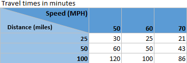
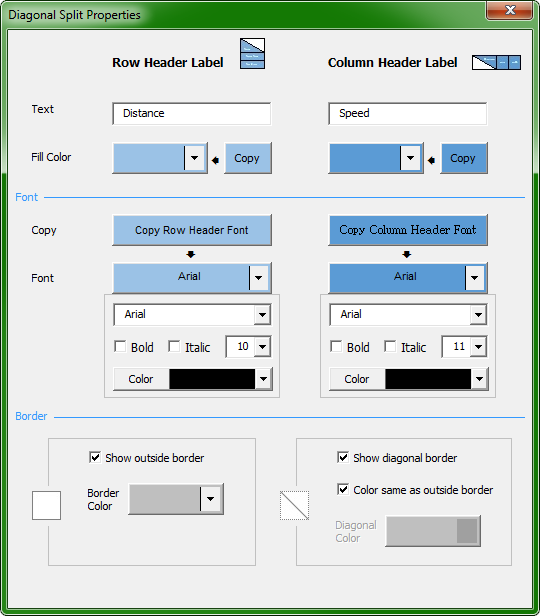

# Excel-TableCornerLabels  
Adds the ability to split a cell along the diagonal in order to show labels for both the column header and row header.  

Install
-------

The only file you need to download is `CornerLabels.xlam`.  If you also download `Install.bat` into the same directory, you can double-click on `Install.bat` to copy `CornerLabels.xlam` into `"%appdata%\Microsoft\AddIns\"`.

To enable the add-in:
1. Open Excel and select a blank workbook (or any workbook).
1. Click the __File__ tab, click __Options__, and then click the __Add-Ins__ category in the left pane of the Excel Options dialog.
1. In the __Manage__ dropdown box, select __Excel Add-ins__, and then click __Go__.  This will open the Add-ins dialog and close the options dialog.
1. In the __Add-ins available__ list, select the check box next to __Cornerlabels__, and then click __OK__.

Usage &nbsp; &nbsp; 
-----

You will now have a new section on the __Home__ tab bar called __Diagonal Split__ containing an __Add/Edit__ button.

It is best to add the split cell after you have set up your column and row headers.  This is because the split cell will default to using the formatting from those headers.  However, you can use the Copy buttons within the Add/Edit dialog to copy the header formatting later.

License
-------

Published under the [GPL v3 license](LICENSE).

	Copyright (C) 2018  Evan Barr <http://github.com/evanbarr>

	This program is free software: you can redistribute it and/or modify
	it under the terms of the GNU General Public License as published by
	the Free Software Foundation, either version 3 of the License, or
	(at your option) any later version.

	This program is distributed in the hope that it will be useful,
	but WITHOUT ANY WARRANTY; without even the implied warranty of
	MERCHANTABILITY or FITNESS FOR A PARTICULAR PURPOSE.	See the
	GNU General Public License for more details.

Microsoft®, Windows®, Office, and Excel® are either registered
trademarks or trademarks of Microsoft Corporation in the United States
and/or other countries.

About Me
--------
[Profile][]  
[Blog][]  

[Profile]: https://www.linkedin.com/in/evanbarr/
[Blog]: https://evansblog.thebarrs.info
